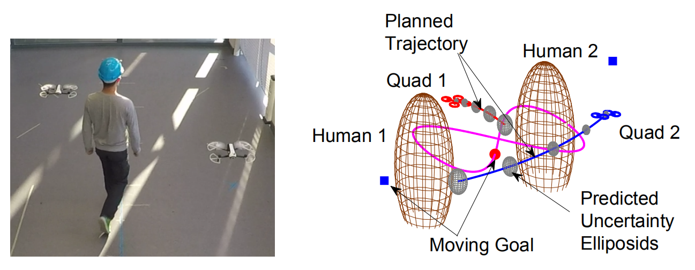
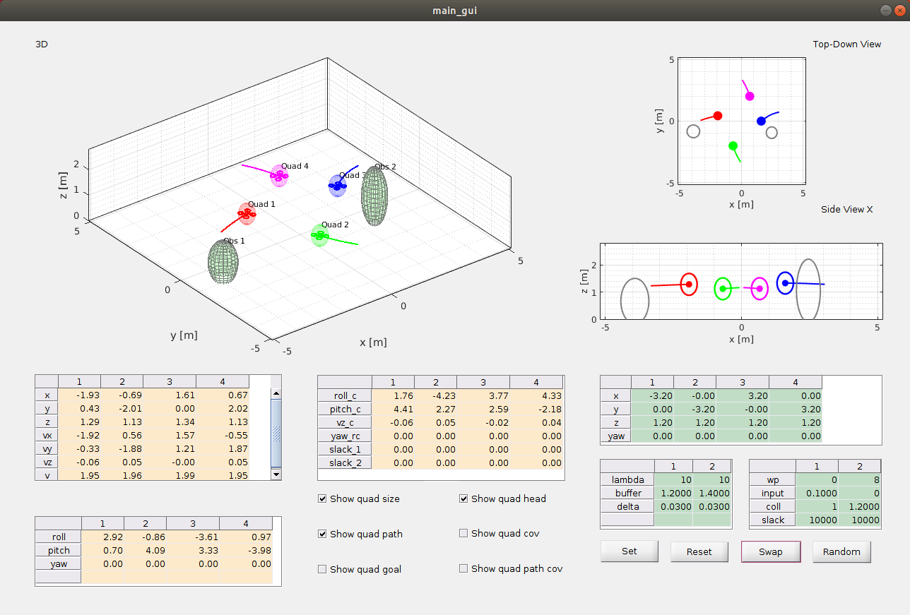

# Model Predictive Control for Multi-MAV Collision Avoidance in Dynamic Environments

This repository contains the code for the paper:

**<a href="https://ieeexplore.ieee.org/document/8613928">Chance-Constrained Collision Avoidance for MAVs in Dynamic Environments</a>**
<br>
<a href="https://www.tudelft.nl/en/staff/h.zhu/">Hai Zhu</a>, and 
<a href="http://www.tudelft.nl/staff/j.alonsomora/">Javier Alonso-Mora</a>
<br>
Published in [RA-L + ICRA 2019]. You can find the full-text paper <a href="https://www.researchgate.net/publication/330432832_Chance-Constrained_Collision_Avoidance_for_MAVs_in_Dynamic_Environments">here</a>. 

Please click in the image to see our video:

<div align='center'>
<a href="https://www.youtube.com/watch?v=P7SUFEKUP9Q&feature=youtu.be"></img></a>
</div>
<div align='center'>
<a href="https://www.youtube.com/watch?v=P7SUFEKUP9Q&feature=youtu.be"></img></a>
</div>

If you find this code useful in your research then please cite:
```
@article{Zhu2019RAL,
    title = {{Chance-Constrained Collision Avoidance for MAVs in Dynamic Environments}},
    author = {Zhu, Hai and Alonso-Mora, Javier},
    journal = {IEEE Robotics and Automation Letters},
    number = {2},
    volume = {4},
    pages = {776--783},
    publisher = {IEEE},
    year = {2019}
}
```
The authors would like to thank <a href="https://www.embotech.com/">Embotech</a> for providing a license of the <a href="https://www.embotech.com/forces-pro/">FORCES PRO</a> software.

## Software Requirements
* ROS installation
* Ubuntu 16.04 (or 18.04)
* MATLAB R2017b (or R2019b) with the Robotics System Toolbox
* FORCES PRO software

## Installation instructions
This set of instructions have been tested for Ubuntu 16.04 with ROS-Kinetic and MATLAB R2017b, and Ubuntu 18.04 with ROS-Melodic and MATLAB R2019b. 

## Running Simulations
* Problem Set Up
    1. Launch a MATLAB instance and open initialize.m
    2. Setup the number of drones and dynamic obstacles
    3. Set cfg.modeSim as 1
    4. Set getNewSolver as 1 if a new mpc solver is required to be generated

* Open Visualization
    1. Start a MATLAB instance
    2. Run the script run_visual.m

* Open the Controller
    1. Start another MATLAB instance
    2. Run the script run_main_basic.m

## Running Experiments
The code supports running experiments using the Parrot Bebop 2 quadrotors. Real-time state estimation of the quadrotors and moving obstacles are required. The following packages will be useful if you want to set up real-world experiments: 
* bebop2_toolbox: https://github.com/hai-zhu/bebop2_toolbox.git
* obstacle_estimator: https://github.com/hai-zhu/obstacle_estimator.git
* bebop_autonomy: https://github.com/AutonomyLab/bebop_autonomy.git 
